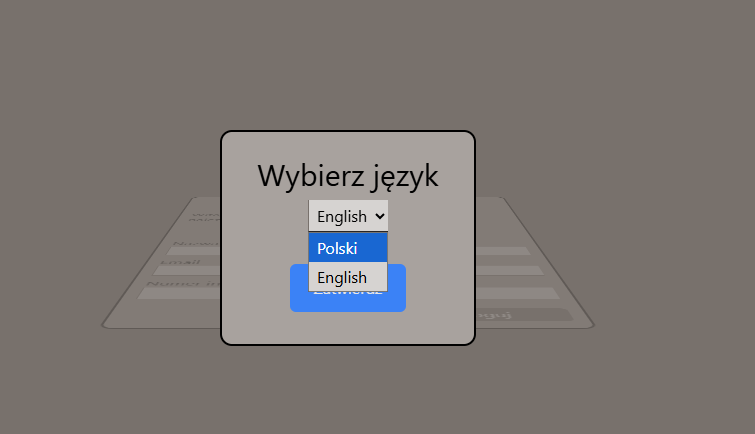
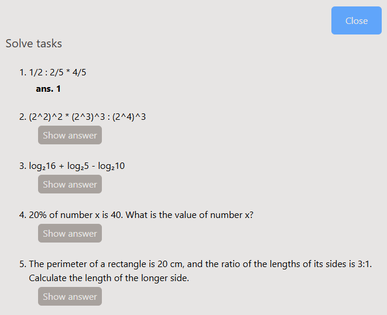

<header style="margin-bottom: 1rem">
    <h1 style="margin-bottom: 0">Matematyczny Kursor Maturalny</h1>
    
"Matematyczny Kursor Maturalny" to aplikacja, która umożliwia powtórkę przed maturą z wybranego działu matematycznego oraz generowanie losowego arkusza egzaminacyjnego. Wstępna wersja pozwala jedynie na przeglądanie odpowiedzi do zadań, bez dodatkowych wskazówek dotyczących ich rozwiązania. Użytkownicy mogą obecnie wybierać pomiędzy dwoma językami: polskim i angielskim, a prace nad rozszerzeniem funkcji aplikacji są w trakcie realizacji.

</header>

<h3>Link do aplikacji</h3>
<a href="https://mature-app.netlify.app" style="margin-bottom: 2rem" class="md-button md-button--primary" target='_blank'>mathApp</a>

<h3>Wybór języka</h3>

<h3>Arkusz egzaminacyjny</h3>

